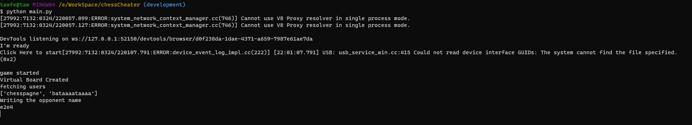

<h2>ChessCheater?</h2>

<p> A made-for-fun project that I built to improve my automation skills when I saw myself wasting a lot of time playing chess </p>

<b><p style="color: red;">According to chess.com <a href="https://www.chess.com/legal/user-agreement">terms of service</a> using chessCheater online in rated games is illegal and I'm not responsible for any illegal uses of it!</p></b>

<hr>

<h3> How to set up? </h3>

<p>
    - download any chess engine ( stockfish, komodo, batata or any other engine ) and save it as fish.exe
</p>

<p>
    - create the <code>player.py</code> file and copy from <code>player.py</code> ( make sure to change the username, password )
</p>

<p> setup pythonic stuff</p>

```bash
    $ python -m venv env
    # connect to python virtual env:
    $ source env/Scripts/activate
    # install requirements
    $ pip install -r requirements
```

<hr>

<h3> How to run </h3>

```bash
    # play with bots
    $ python other/bot.py
    # play in the analytics
    $ python other/analytics.py
    # play with **friends**
    $ python main.py
```

<hr>

<h3> how to use (online) </h3>
<p> run the code and join a game (make sure to enable "white always down in chess.com" )</p>
<p> Once you join the first game in the terminal you have to click <code>Enter</code> in the terminal and then you can leave it, it's now able to join new games after it finishes the game that it was playing (: </p>


<hr>

<b><u> feel free to open issues when you face any problem </b></u>
